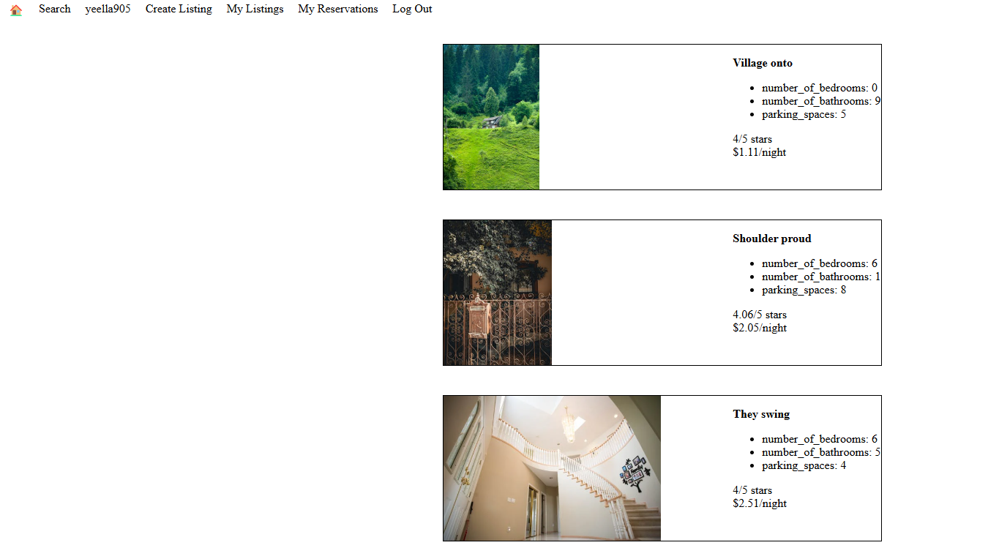

# LightBnB Project

A simple multi page AirBnb clone that uses a server-side Javascript to display information from queries to web pages via SQL queries

## Final Product

### Dependencies

> **_NOTE:_** Before you get started these are the main dependencies:

+ Nodemon
+ Express
+ Pg
+ Cookie-session
+ Bcrypt